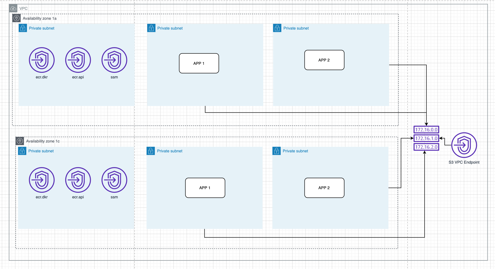

# ECR PrivateLink Terraform Sample
AWS ECRのPrivateLinkを利用して `<AWS Account>.dkr.ecr.<region>.amazonaws.com` からprivate通信（AWS内部の通信）でimageをpullするためのTerraformサンプル。

以下の構成図のような構成をTerraform化している。

以下の理由から、InterfaceタイプのVPCエンドポイントはAPP用のsubnetとは分離している

- 利用する側のリソース(APP1, APP2)が配備されているのと同じVPCであれば問題ない（ルーティングできれば良い）ため
    - 暗黙的にlocalと結ばれるはずなので放置で良い認識（動作確認した範囲でも大丈夫そう）
- InterfaceタイプのVPCエンドポイントは同じAZにつき1つのsubnetまでしか配備できないため
    - 特定のAPP用のsubnetに配置してしまうと紛らわしい

# 参考
- [エンドポイントを使用してプライベートサブネットでECSを使用する](https://dev.classmethod.jp/articles/privatesubnet_ecs/)
- [Amazon ECR インターフェイス VPC エンドポイント (AWS PrivateLink)](https://docs.aws.amazon.com/ja_jp/AmazonECR/latest/userguide/vpc-endpoints.html)
